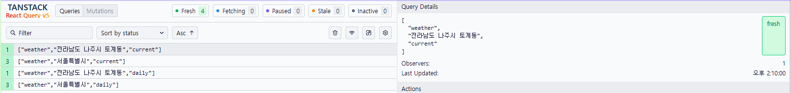

# RealTeeth 채용 과제

RealTeeth 채용 과제로 날씨 앱 구현한 프로젝트입니다.

## 요구사항

### 필수 환경

- **Node.js ≥20.9.0** (프로젝트는 24.13.0 사용)
- **TypeScript ≥5.1.0**
- **pnpm 10.28.0** (Corepack으로 자동 관리)
- **nvm** (Node.js 버전 관리)

### 지원 브라우저

- Chrome 111+
- Edge 111+
- Firefox 111+
- Safari 16.4+

## 프로젝트 실행 방법

### 1. Node.js 버전 설정

```bash
nvm install 24.13.0
nvm use 24.13.0
node -v  # 버전 확인
```

### 2. Corepack 설정

Corepack을 최신 버전으로 업데이트하고 활성화합니다. ([서명키 이슈](https://pnpm.io/installation#using-corepack))

```bash
npm install --global corepack@latest
corepack enable pnpm
```

### 3. 환경 변수 설정

프로젝트 실행을 위해 API 키 설정이 필요합니다.

```bash
# .env.example 파일을 .env로 복사
cp .env.example .env
```

`.env` 파일을 열어 다음 API 키를 발급받아 입력하세요:

- **KMA_API_KEY**: [기상청 단기예보 API](https://www.data.go.kr/data/15084084/openapi.do) 인증키
- **VWORLD_API_KEY**: [브이월드 Reverse Geocoding API](https://www.vworld.kr/dev/v4dv_geocoderguide2_s001.do) 인증키

```env
KMA_API_KEY=your_kma_api_key_here
VWORLD_API_KEY=your_vworld_api_key_here
TZ=Asia/Seoul
NEXT_PUBLIC_BASE_URL=http://localhost:3000
```

### 4. 의존성 설치

```bash
corepack pnpm install
```

### 5. 개발 서버 실행

```bash
corepack pnpm dev
```

브라우저에서 [http://localhost:3000](http://localhost:3000)을 열어 결과를 확인할 수 있습니다.

## 사용 가능한 스크립트

```bash
corepack pnpm dev      # 개발 서버 실행
corepack pnpm build    # 프로덕션 빌드
corepack pnpm start    # 프로덕션 서버 실행
corepack pnpm lint     # ESLint 실행
```

## 참고사항

- 이 프로젝트는 `packageManager` 필드를 통해 pnpm 버전을 고정합니다.
- Corepack이 자동으로 올바른 버전의 pnpm을 사용합니다.
- `.nvmrc` 파일에 Node.js 버전이 명시되어 있습니다.

---

## 기술 스택

### Core

- **Next.js 16.1.1** - React 기반 풀스택 프레임워크
- **React 19** - UI 라이브러리
- **TypeScript 5** - 타입 안정성

### 상태 관리 & 데이터 페칭

- **TanStack Query (React Query) 5** - 서버 상태 관리 및 캐싱
- **Zustand 5** - 클라이언트 전역 상태 관리

### 스타일링

- **Tailwind CSS 4** - 유틸리티 기반 CSS 프레임워크
- **CVA (Class Variance Authority)** - 컴포넌트 variant 관리
- **clsx & tailwind-merge** - 조건부 클래스 관리

### UI/UX

- **Recharts** - 날씨 데이터 시각화 (차트)
- **React Icons** - 아이콘 라이브러리
- **Headless UI** - 접근성을 고려한 UI 컴포넌트

### 유틸리티

- **Day.js** - 날짜/시간 처리
- **Fuse.js** - 퍼지 검색 (주소 검색)
- **Zod** - 런타임 타입 검증 및 스키마 정의

### 개발 도구

- **ESLint & Prettier** - 코드 품질 및 포맷팅
- **Husky & lint-staged** - Git hooks 및 커밋 전 검증
- **Commitlint** - 커밋 메시지 컨벤션 관리
- **Jest & Testing Library** - 테스트 프레임워크

---

## 구현한 기능

### 1. 현재 위치 기반 날씨 조회

- 사용자의 브라우저 위치 정보를 기반으로 현재 위치의 날씨 자동 표시
- **정부 Reverse Geocoding 공개 API** 활용하여 위경도를 행정구역 주소로 변환
- **Fallback 전략**: GPS → IP 기반 위치 → 서울특별시 기본값
- 현재 기온, 날씨 상태, 습도, 풍속, 강수량 등 상세 정보 제공
- 위치 정보는 localStorage 저장

### 2. 지역 검색 및 날씨 조회

- 전국 시/군/구/리 단위 주소 검색 기능
- **Fuse.js 퍼지 검색**: 오타에 강한 검색 제공
- **법정동 ↔ 행정동 자동 매칭**: 2만+ 개 주소 데이터에 대해 테스트 코드로 검증
- 검색 데이터를 `public` 폴더에 배치하여 브라우저 캐싱 활용
- 검색한 지역의 상세 날씨 정보 표시
- 유효하지 않은 주소 입력 시 안내 메시지 표시 (UI적으로는 막음)
- Query String으로 검색하여 히스토리 캐싱 활용 및 UX 개선

### 3. 즐겨찾기 관리

- **즐겨찾기 추가/삭제**: 자주 확인하는 지역을 즐겨찾기에 저장
- **별칭(Alias) 설정**: 저장된 지역에 사용자 지정 이름 설정 가능
- **즐겨찾기 목록**: 저장된 모든 지역의 날씨를 한눈에 확인
- **Zustand Persist**: LocalStorage를 통한 영구 저장 및 간편한 상태 관리
- 브라우저를 껐다 켜도 즐겨찾기 유지

### 4. 날씨 데이터 시각화

- **현재 날씨 카드**: 실시간 기온, 체감온도, 날씨 상태 표시
- **일일 날씨 카드**: 당일 최고/최저 기온 및 시간대별 기온 추이
- **시간별 기온 차트**: Recharts를 활용한 인터랙티브 그래프

### 5. 반응형 디자인 & 다크모드

- 모바일, 데스크톱 화면에 최적화된 레이아웃
- 다크모드 자동 지원 (시스템 설정 기반)
- Tailwind CSS를 활용한 일관된 디자인 시스템
- 자체 디자인 시스템 구축

### 6. 성능 최적화

- **Next.js 16 캐싱 전략**: `use cache` 디렉티브를 활용한 서버 측 캐싱
- **주소별 캐시 태그**: 세밀한 캐시 무효화 전략
- **React Query**: 클라이언트 측 데이터 캐싱 및 API 업데이트 주기에 맞춘 자동 리페칭
- **React Suspense**: Streaming SSR로 빠른 초기 로딩
- **스켈레톤 UI**: 데이터 로딩 중 사용자 경험 개선
- **Lighthouse 성능 점수 100점** (즐겨찾기 6개 등록 상태 기준)

### 7. 접근성 (Accessibility)

- Semantic HTML 사용
- ARIA 레이블 및 역할 명시
- 키보드 네비게이션 지원
- Headless UI를 통한 접근성 보장

---

## 기술적 의사결정 및 이유

### 1. 위치 기반 서비스 아키텍처

#### Reverse Geocoding 전략

위경도 좌표를 행정구역 주소(기상청이 행정구역 기준)로 변환하는 방법(Reverse Gecode)으로 세 가지 접근법을 고려했습니다:

1. **기상청 행정구역-좌표 매칭 데이터로 직접 계산** - 구현했으나 법적(지번) 주소 변환이 또 필요.
2. **타사 API 활용** - 신뢰도와 유지보수 측면에서 불안정
3. **정부 Reverse Geocoding 공개 API 활용**을 선택

**선택 이유:**

- 정부 API는 공식 데이터로 신뢰도가 높고 지속적인 유지보수 보장
- 법정동 주소를 정확하게 제공하여 기상청 API와 연동 가능
- 무료 제공으로 비용 부담 없음

#### 위치 정보 Fallback 전략

사용자 위치 조회는 다음 우선순위로 동작합니다:

1. **GPS 위치 정보** (1순위)
2. **IP 기반 대략적 위치** (GPS 실패 시)
3. **서울특별시 기본값** (모든 방법 실패 시)

이를 통해 어떤 환경에서도 날씨 정보를 제공할 수 있도록 보장했습니다. IP기반 위/경도 정보는 무료
공개 API를 사용하였습니다.

#### 위치 정보 저장: Cookie → LocalStorage

**초기 계획:** Cookie 사용
**최종 선택:** LocalStorage

**변경 이유:**

- 위치 정보는 민감한 개인정보로 서버로 전송될 필요가 없음
- Cookie는 모든 HTTP 요청에 포함되어 불필요한 데이터 전송 발생
- LocalStorage는 클라이언트에서만 관리되어 보안과 성능 모두 우수

---

### 2. 검색 기능 설계

#### Fuzzy Search 적용

Fuse.js를 활용한 퍼지 검색으로 사용자 편의성을 극대화했습니다.

**핵심 문제:**

- 검색 데이터는 **법정동 주소** (예: 서초구 서초동)
- 기상청 API는 **행정동 주소** 사용 (예: 서초구 서초1동, 서초2동, ...)
- 두 주소 체계가 달라 직접 매칭 불가능

**해결 방법:**

1. Fuzzy 검색으로 법정동 → 행정동 자동 매칭
2. 2만+ 개의 주소 데이터에 대해 테스트 코드로 검증 완료
3. 한글 초성 검색, 초성/중성/종성 분리 검색 구현 후 성능 이슈로 제거
4. 최소한의 커스터마이징으로 편리하고 빠른 검색 구현

#### 검색 데이터 최적화

- `.json` 파일을 `public` 폴더로 분리하여 브라우저 캐싱 활용
- Lazy import로 초기 번들 크기 감소 / RSC에 포함되지 않어 렌더링 속도 증가
- 데이터를 캐싱하여 재방문 시 즉시 로드

---

### 3. 즐겨찾기 상태 관리

#### Zustand Persist 선택

**고려 사항:**

- Cookie 사용 시 서버에서 즐겨찾기 데이터를 받아 SSR 가능
- 하지만 개인 즐겨찾기는 검색 엔진 노출 불필요
- Cookie 관리 유틸 구현은 과도한 복잡도 증가

**최종 선택:** Zustand + LocalStorage Persist

**장점:**

- 간단한 API로 상태 관리 및 영구 저장 동시 해결
- 브라우저를 껐다 켜도 데이터 유지
- 서버 부하 없이 클라이언트에서 모든 처리 완료

---

### 4. 데이터 페칭 전략

#### React Query 활용 전략

**날씨 정보: `useSuspenseQuery`**

- Streaming SSR과 Suspense 통합을 위해 사용
- API 캐싱 시간에 맞춰 자동 리페칭 (`refetchInterval`, 'staleTime' `cacheTime` 설정)
  
  기상청 실시간 날씨는 매 1시 10분, 1시 20분, 1시 30분... 10분 간격 데이터 업데이트를 하기 때문에 해당 주기에 맞춰 refetch 하도록 하기 위해서 refetchInterval을 사용했습니다. staleTime은 stale 해지면 다시 refetch 하기 위한 조건이 해당 query가 remount되어야 하는데 화면만 켜놔도 새롭게 보여주는게 맞다고 생각했기 때문에 refetchInterval을 사용했습니다.그리고 최소 1분 또는 3분의 refetchInterval을 가져 연속적인 fetching을 방지했습니다.
  . refetchInterval과 staleTime은 독립적이기 때문에 staleTime 설정은 기상청의 API 데이터 갱신 주기로 했습니다
- 현재 온도, 일일 최고/최저 기온, 시간별 기온이 각각 다른 API이므로 독립적으로 스트리밍

**캐싱 시간 관리:**

- 기상청 API 업데이트 주기에 맞춰 정확한 캐싱 타임 계산
- 테스트 코드로 캐싱 로직 검증 완료

#### 서버 캐싱: Next.js 16 `use cache`

**적용 범위:**

- API Route에서 `use cache` 디렉티브 활용
- 주소별 `cacheTag`로 세밀한 캐시 무효화 전략 구현

**제한 사항:**

- Dynamic Component Caching은 아직 불안정하여 적용 보류
- Serializable 데이터만 캐싱 가능 → Zod로 타입 안정성 보장

**시도 후 제거한 방식:**

- `HydrationBoundary`를 통한 서버 데이터 전달 방식 구현
- 캐싱 추적 복잡도 증가 및 관리 어려움으로 제거

---

### 5. Third-Party API 의존성 분리

#### 레이어 분리 아키텍처

모든 도메인 서비스가 외부 API에 의존하므로 외부 API의 변경 가능성을 고려한 설계를 적용했습니다.

**구조:**

```
예시 : 클라이언트 코드 → 도메인 서비스 인터페이스 (weatherService) → Third-Party API
```

**장점:**

- Third-Party 라이브러리 교체 시 서비스 인터페이스만 수정
- 도메인 로직과 API 구현체 완전 분리
- 폴더 구조로도 명확히 구분하여 유지보수성 향상

---

### 6. Hydration Mismatch 해결

#### 문제 상황

LocalStorage에 저장된 데이터에 따라 첫 렌더링 UI가 달라야 하는 경우, 서버와 클라이언트의 렌더링 결과가 달라 Hydration Mismatch 에러 발생

**고려한 해결책:**

1. **Cookie 사용** - SSR에서 개인화된 화면 제공 가능하지만 성능 저하
2. **첫 렌더링 UI 일치** 하도록 구현하여 해결

**해결 방법:**

- Zustand의 `_hydrated` 플래그 활용
- 첫 렌더링에서는 기본 UI 표시
- 클라이언트 hydration 완료 후 LocalStorage 데이터 반영

이를 통해 성능과 사용자 경험의 균형을 맞췄습니다.

---

### 7. 디자인 시스템

#### 자체 디자인 시스템 구축

- **Headless UI** - 접근성이 필요한 컴포넌트에만 선택적 활용
- **간단한 Color Palette** - Tailwind CSS 기본 색상 활용
- **다크모드** - `prefers-color-scheme` 미디어 쿼리로 자동 전환
- **반응형 레이아웃** - Grid, Flexbox, Order 속성으로 모바일/데스크톱 최적화

과도한 디자인 시스템 라이브러리 도입 대신 필요한 컴포넌트만 직접 구현하여 번들 크기와 복잡도를 최소화했습니다.

---

### 8. 성능 최적화 검증

#### Lighthouse 테스트 결과

- **테스트 조건:** 즐겨찾기 6개 모두 등록된 상태
- **결과:** 로컬 환경 기준 **Performance 100점**
- **결론:** 현재 구현으로 충분한 성능 확보

최적화 포인트:

- Streaming SSR로 빠른 초기 렌더링
- 효율적인 캐싱 전략
- 최소한의 JavaScript 번들
- 이미지 및 아이콘 최적화
