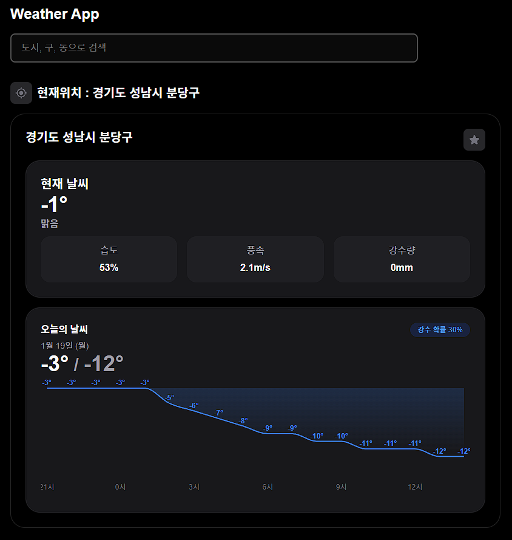
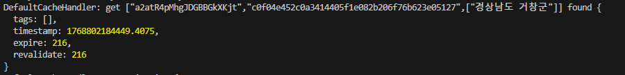
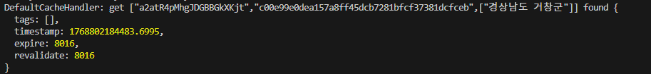

# RealTeeth 채용 과제 - 윤동근

RealTeeth 채용 과제로 날씨 앱 구현한 프로젝트입니다.
배포 주소 : https://realteeth-eta.vercel.app/

## 요구사항

### 필수 환경

- **Node.js ≥20.9.0** (프로젝트는 24.13.0 사용)
- **TypeScript ≥5.1.0**
- **pnpm 10.28.0** (Corepack으로 자동 관리)
- **nvm** (Node.js 버전 관리)

### 지원 브라우저

- Chrome 111+
- Edge 111+
- Firefox 111+
- Safari 16.4+

## 프로젝트 실행 방법

### 1. Node.js 버전 설정

```bash
nvm install 24.13.0
nvm use 24.13.0
node -v  # 버전 확인
```

### 2. Corepack 설정

Corepack을 최신 버전으로 업데이트하고 활성화합니다. ([서명키 이슈](https://pnpm.io/installation#using-corepack))

```bash
npm install --global corepack@latest
corepack enable pnpm
```

### 3. 환경 변수 설정

프로젝트 실행을 위해 API 키 설정이 필요합니다.

```bash
# .env.example 파일을 .env로 복사
cp .env.example .env
```

`.env` 파일을 열어 다음 API 키를 발급받아 입력하세요:

- **KMA_API_KEY**: [기상청 단기예보 API](https://www.data.go.kr/data/15084084/openapi.do) 인증키
- **VWORLD_API_KEY**: [브이월드 Reverse Geocoding API](https://www.vworld.kr/dev/v4dv_geocoderguide2_s001.do) 인증키

```env
KMA_API_KEY=your_kma_api_key_here
VWORLD_API_KEY=your_vworld_api_key_here
TZ=Asia/Seoul
```

### 4. 의존성 설치

```bash
corepack pnpm install
```

### 5. 개발 서버 실행

```bash
corepack pnpm dev
```

브라우저에서 [http://localhost:3000](http://localhost:3000)을 열어 결과를 확인할 수 있습니다.

## 사용 가능한 스크립트

```bash
corepack pnpm dev      # 개발 서버 실행
corepack pnpm build    # 프로덕션 빌드
corepack pnpm start    # 프로덕션 서버 실행
corepack pnpm lint     # ESLint 실행
```

## 참고사항

- 이 프로젝트는 `packageManager` 필드를 통해 pnpm 버전을 고정합니다.
- 어느 환경에서도 일관된 버전 사용을 위해 Corepack을 사용했습니다.
- `.nvmrc` 파일에 Node.js 버전이 명시되어 있습니다.

---

## 기술 스택

### Core

- **Next.js 16.1.1** - React 기반 풀스택 프레임워크
- **React 19** - UI 라이브러리
- **TypeScript 5** - 타입 안정성

### 상태 관리 & 데이터 페칭

- **TanStack Query (React Query) 5** - 서버 상태 관리 및 캐싱
- **Zustand 5** - 클라이언트 전역 상태 관리

### 스타일링

- **Tailwind CSS 4** - 유틸리티 기반 CSS 프레임워크
- **CVA (Class Variance Authority)** - 컴포넌트 variant 관리
- **clsx & tailwind-merge** - 조건부 클래스 관리

### UI/UX

- **Recharts** - 날씨 데이터 시각화 (차트)
- **React Icons** - 아이콘 라이브러리
- **Headless UI** - 접근성을 고려한 UI 컴포넌트

### 유틸리티

- **Day.js** - 날짜/시간 처리
- **Fuse.js** - 퍼지 검색 (주소 검색)
- **Zod** - 런타임 타입 검증 및 스키마 정의

### 개발 도구

- **ESLint & Prettier** - 코드 품질 및 포맷팅
- **Husky & lint-staged** - Git hooks 및 커밋 전 검증
- **Commitlint** - 커밋 메시지 컨벤션 관리
- **Jest & Testing Library** - 테스트 프레임워크

---

## 구현한 기능

### 1. 현재 위치 기반 날씨 조회

- 사용자의 브라우저 위치 정보를 기반으로 위치와 날씨를 자동으로 표시합니다. 이때 GPS 동의가 없다면 Fallback 전략으로
  데이터를 가져옵니다.
- **Fallback 전략**: GPS → IP 기반 위치 추정 → 서울특별시 기본값
- https://free.freeipapi.com 의 무료 API를 통해 IP의 ISP 업체의 위/경도를 가져왔습니다.
- 가져온 위/경도로 **정부에서 제공하는 Reverse Geocoding API**를 활용하여 법적 주소(지번 주소, 법정동)을 가져옵니다.
- 과제에 제시된 json 파일에 해당 주소 존재 여부를 확인한 뒤 사용자에게 display용으로 제공합니다.
- 해당 주소로 통계청에서 사용하는 좌표계의 좌표값을 구해 날씨 정보를 제공합니다.
- 현재 기온, 최고 온도, 최저 온도, 시간별 온도 등 제공.
- **Zustand Persist**: LocalStorage를 통한 영구 저장 및 간편한 상태 관리를 했으며 홈 화면의 GPS 아이콘 버튼으로 갱신할 수 있습니다.
- 위치 정보는 유저마다 완전히 다르며, 새롭게 GPS 정보를 받아서도 위치 정보를 보여주는 경우도 있기 때문에 클라이언트에서 데이터를 받아서 출력하는 것이 더 유리하다고 판단하였습니다. 그리고 UI적으로 하이드레이션 에러를 막을 수 있는 방향으로 프리렌더링 되도록 날씨 카드 컴포넌트를 설계했습니다.

| 라이트 모드 현재 위치 날씨            | 다크 모드 현재 위치 날씨            |
| ------------------------------------- | ----------------------------------- |
|  |  |

### 2. 지역 검색 및 날씨 조회

- 전국 시/군/구/동 단위 주소 검색 기능
- 검색한 지역의 상세 날씨 정보 표시
- **Fuse.js 퍼지 검색**: 오타에 강한 검색 제공
- **법정동 ↔ 행정동 자동 매칭**: 2만+개의 모든 법정동 주소 데이터 매칭 여부 테스트 코드로 검증
- 검색 데이터를 `public` 폴더에 배치하여 브라우저 캐싱 + lazy import 활용
- 유효하지 않은 주소 입력 시 안내 메시지 표시 (주소 창 쿼리 스트링으로만 확인 가능 UI적 접근 불가)
- PPR을 적용하여 현재 날씨와 1시간 마다의 날씨를 별도로 스트리밍합니다.
- Virtual Scroll 적용하지 않고 좋은 검색 엔진으로 쉽게 검색되서 사용자가 고르도록 만드는 것이 UX적으로 좋다고 판단하여 10개만 출력하게 만들었습니다.

### 3. 즐겨찾기 관리

- **즐겨찾기 추가/삭제**: 중복되지 않은 장소를 즐겨찾기 가능합니다. localStorage에 저장됩니다.
- **별칭(Alias) 설정**: 저장된 지역에 사용자 지정 이름 설정 가능하며 localStorage에 저장됩니다.
- **즐겨찾기 목록**: 저장된 모든 지역의 날씨 확인
- **Zustand Persist**를 사용하여 LocalStorage를 통한 영구 저장을 했습니다.

### 4. 날씨 데이터 시각화

- **시간별 기온 차트**: Recharts를 활용한 인터랙티브 그래프

### 5. 반응형 디자인 & 다크모드

- 모바일, 데스크톱 화면에 최적화된 레이아웃
- 다크모드 자동 지원 (시스템 설정 기반)
- Tailwind CSS를 활용한 일관된 디자인 시스템
- CVA를 이용한 가독성 높은 컴포넌트 variant별 class 관리
- 자체 디자인 시스템 구축

### 6. 성능 최적화

- **Next.js 16 캐싱 전략**: `use cache` 디렉티브를 활용한 서버 측 캐싱
- **주소별 캐시 태그**: 세밀한 캐시 무효화 전략
- **React Query**: 클라이언트 측 데이터 캐싱을 서비스와 API 특성을 고려하여 완벽맞춤으로 refetchInterval 속성을 사용하여 구현했습니다. 단순 정적 캐싱 시간 할당이 아니라 최적화된 시간으로 할당되도록 만들었습니다. 이는 매우 중요한 기능이라 생각하여 테스트코드를 통해 기능 검증을 했습니다.
- **React Suspense**: Streaming SSR로 빠른 로딩 체감
- **스켈레톤 UI**: 데이터 로딩 중 사용자 경험 개선
- 로컬 컴퓨터 네트워크와 성능에서 **Lighthouse 성능 점수 100점**

### 7. 접근성 (Accessibility)

- Semantic HTML 사용
- ARIA 레이블 및 역할 명시
- 키보드 네비게이션 지원
- Headless UI를 통한 접근성 보장

---

## 기술적 의사결정 및 이유

### 1. 위치 기반 서비스 아키텍처

#### Reverse Geocoding 전략

위경도 좌표를 법정구역 주소(기상청은 행정 주소 기준, UI는 법정 주소 기준)로 변환하는 방법(Reverse Gecode)으로 세 가지 접근법을 고려했습니다:

1. **기상청 행정구역-좌표 매칭 데이터로 직접 계산** - 구현했으나 결국 법적(지번) 주소 변환이 필요하여 3번의 API 사용 필요.
2. **타사 API 활용** - 신뢰도와 유지보수 측면에서 불안정
3. **정부 Reverse Geocoding 공개 API 활용**

이 중에서 저는 3번째 방법을 사용했습니다.

**선택 이유:**

- 정부 API는 공식 데이터로 신뢰도가 높고 지속적인 유지보수 보장
- 법정동 주소를 정확하게 제공하여 기상청 API와 연동 가능
- 무료 제공으로 비용 부담 없음

#### 위치 정보 Fallback 전략

사용자 위치 조회는 사용자에게 항상 GPS 정보를 요구할 수 없기 때문에 다음 우선순위로 동작하도록 만들었습니다.

1. **GPS 위치 정보** (1순위)
2. **IP 기반 대략적 위치** (GPS 실패하여 위치 정보를 못받을 시)
3. **서울특별시 기본값** (모든 방법 실패 시)

이를 통해 어떤 환경에서도 날씨 정보를 제공할 수 있도록 보장했습니다. IP기반 위/경도 정보는 https://free.freeipapi.com 무료 공개 API를 사용하였습니다. 그리고 이 위/경도 정보를 기반으로 정부의 VWorld Reverse Geocoding API를 사용하여 해당 위치의 법적 주소를 구해서 주소 이름을 사용자에게 보여줄 수 있게 만들었습니다.

#### 위치 정보 저장: Cookie → LocalStorage

**초기 계획:** Cookie 사용
**최종 선택:** LocalStorage

**변경 이유:**

- 위치 정보는 민감한 개인정보로 지속적으로 서버로 전송되기엔 부담.
- Cookie는 모든 HTTP 요청에 포함되어 불필요한 데이터 전송 발생
- LocalStorage는 클라이언트에서만 관리되어 성능 영향이 없고, Zustand를 통해서 관리하면 별도로 Cookie 관리 유틸같은 것을 구현할 필요가 없음.
- Cookie를 이용해서 사용자의 위치 일기예보를 바로 보여줄 수 있게 할 수 있지만, 이렇게 하면 첫 렌더링에 소모되는 자원이 많아질 것이라 판단하여 Client 쪽에서 처리하게 만들었습니다.

---

### 2. 검색 기능 설계

#### 2.1 클라이언트 검색 UX

Fuse.js를 활용한 퍼지 검색으로 사용자 편의성을 극대화했습니다.

**구현 기능:**

- 오타에 강한 클라이언트 사이드 퍼지 검색 제공
- 한글 초성 검색, 초성/중성/종성 분리 검색 구현 후 성능 이슈로 제거하며, 종성부분 처리만 추가하여 체감이 좋은 검색 엔진 생성.
- Virtual Scroll 대신에 검색 엔진을 활용하여 정확한 데이터 출력으로 UX 향상
- 검색 데이터 최적화:
  - `.json` 파일을 `public` 폴더로 분리하여 브라우저 캐싱 활용
  - Lazy import로 초기 번들 크기 감소 / RSC에 포함되지 않아 렌더링 속도 증가
  - 데이터를 캐싱하여 재방문 시 즉시 로드

#### 2.2 서버 주소 변환 최적화

법정동-행정동 주소 체계 차이로 인한 API 호출 최소화 전략입니다.

**핵심 문제:**

- 검색 데이터는 **법정동 주소** (예: 서초구 서초동)
- 기상청 API는 **행정동 주소** 사용 (예: 서초구 서초1동, 서초2동, ...)
- 두 주소 체계가 달라 직접 매칭 불가능
- 순진한 방식: **법정동 주소** => **위도 경도** => **기상청 좌표계 nx, ny 변환** => **날씨 조회**
- 위 방식은 2~3번의 외부 API 호출이 필요하여 응답 지연 발생

**해결 방법:**

1. 서버에서 Fuse.js를 활용하여 법정동 → 행정동 자동 매칭 검색 엔진 구현
2. 기상청 제공 행정동 주소-좌표 변환 엑셀 데이터를 로컬에서 활용
3. 외부 API 호출 없이 서버 로컬에서 빠르게 주소 변환 처리
4. 2만+ 개의 모든 주소 데이터에 대해 테스트 코드로 매칭 검증 완료

**성능 개선:**

- API 요청 수 2~3회 → 0회로 감소
- 응답 시간 단축 및 외부 API 장애 영향 최소화

---

### 3. 즐겨찾기 상태 관리

#### Zustand Persist 선택

**고려 사항:**

- Cookie 사용 시 서버에서 즐겨찾기 데이터를 받아 SSR 가능
- 하지만 개인 즐겨찾기는 검색 엔진 노출 불필요
- 쿠키를 통해 첫 렌더링에 사용자 정보를 모두 반영하면 체감 성능이 안좋을 것이라 판단
- Cookie 관리 유틸 구현은 복잡도 증가

**최종 선택:** Zustand + LocalStorage Persist

**장점:**

- 간단한 API로 상태 관리 및 영구 저장 동시 해결
- 브라우저를 껐다 켜도 데이터 유지
- 서버 프리 렌더링 부하 없이 클라이언트에서 모든 처리 완료

---

### 4. 데이터 페칭 전략

#### React Query 활용 전략

**날씨 정보: `useSuspenseQuery`**

- Streaming SSR에서 Suspense, HydrationBoundary와 함께 useSuspenseQuery를 사용하였고, 이를 통해 코드 상 타입 체크를 줄이게 만들었습니다.
- ClientSide에서는 Suspense Rendering으로 데이터 불러오는 동안 Loading Fallback 출력을 위해 사용했습니다.
- API 캐싱 시간에 맞춰 자동 리페칭 (`refetchInterval`, `staleTime`, `cacheTime` 설정)
  
  - 기상청 실시간 날씨는 매 10분 간격(10분, 20분, 30분...)으로 데이터를 업데이트합니다.
  - `refetchInterval`을 사용하여 해당 주기에 맞춰 자동으로 refetch하도록 구현했습니다.
  - `staleTime`만으로는 query가 remount되어야 refetch되지만, 화면만 켜놔도 새로운 데이터를 보여주는 것이 더 나은 UX라고 판단했습니다.
  - 최소 1분 또는 3분의 refetchInterval을 설정하여 연속적인 fetching을 방지했습니다.
  - refetchInterval과 staleTime은 독립적이므로, staleTime은 기상청 API 데이터 갱신 주기에 맞춰 설정했습니다.

**캐싱 시간 관리:**

- 기상청 API 업데이트 주기에 맞춰 정확한 캐싱 타임 계산
- 테스트 코드로 캐싱 로직 검증 완료

**HydrationBoundary 사용의 어려움**

- HydrationBoundary를 사용하면 많은 관리 포인트들이 영향을 받아 복잡도가 증가했습니다.
- 예를 들어, Domain Entity에 Dayjs 타입을 그대로 사용했는데, HydrationBoundary는 서버의 queryClient 데이터를 클라이언트로 전달하기 때문에 데이터가 serialize되어야 합니다.
- Dayjs는 Class Instance로 Serialize가 불가능하여 설계를 다시 고민하게 되었습니다.
- 도메인이 특정 라이브러리에 의존하지 않도록 설계해야 한다는 중요한 교훈을 얻었습니다.

#### 서버 캐싱: Next.js 16 `use cache`

**적용 범위:**

- API Route에서 `use cache` 디렉티브 활용
- 기상청 날씨 API의 세밀한 캐시 무효화 전략 구현

**실시간 날씨 API 캐싱:**


- API에 최적화된 동적 캐싱 시간을 적용하여 가장 빠르고 효율적으로 데이터를 제공합니다.
- `expire`를 활용하여 `revalidateTag`와 같은 효과를 구현하여 stale 데이터를 방지했습니다.
- 위 예시에서는 기상청 실시간 예보 데이터가 업데이트되는 주기에 맞춰 캐싱이 만료됩니다.

**동적 시간의 날씨 예보 API 캐싱:**


- 해당 기상청 API에 최적화되어 API 데이터가 업데이트 되는 17:10에 캐싱이 만료되고 새로 받습니다.
- 위의 예시는 address로 캐싱하는 경우이며, 여러 address가 같은 기상청 데이터를 요구할 수 있기 때문에 기상청 데이터도 같은 파라미터에 따라서 캐싱되도록 구현했습니다.

**제한 사항:**

- Dynamic Component Caching은 아직 불안정하여 적용 보류
- 데이터 캐싱의 경우 dynamic한 경우(headers, searchParams 사용)에 캐싱이 불안정하여 제대로 적용되지 않음 (공식 문서대로 해도 동작하지 않음)
- Serializable 데이터만 캐싱 가능 → Zod로 타입 안정성 보장

**시도 후 제거한 방식:**

- "use cache"를 사용하여 function 결과를 Cache 하였으나 로컬에서는 완벽하게 이론대로 작동하지만, vercel 환경에서만 적용되지 않아 fetch의 revalidate 속성을 사용하여 캐싱하게 변경.

---

### 5. Third-Party API 의존성 분리

#### 레이어 분리 아키텍처

모든 도메인 서비스가 외부 API에 의존하므로 외부 API의 변경 가능성을 고려한 설계를 적용했습니다.

**구조:**

```
예시 : 클라이언트 코드 → 도메인 서비스 인터페이스 (weatherService) → Third-Party API
```

**장점:**

- Third-Party 라이브러리 교체 시 서비스 인터페이스만 수정
- 도메인 로직과 API 구현체 완전 분리
- Third Party는 사용되는 도메인의 내부 폴더로 별도로 구성하면서 명확히 구분하여 유지보수성 향상

---

### 6. Hydration Mismatch 해결

#### 문제 상황

LocalStorage에 저장된 데이터에 따라 첫 렌더링 UI가 달라야 하는 경우, 서버와 클라이언트의 렌더링 결과가 달라 Hydration Mismatch 에러 발생

**고려한 해결책**

1. **Cookie 사용** - SSR에서 개인화된 화면 제공 가능하지만 성능 저하
2. **첫 렌더링 UI 일치** 하도록 구현하여 해결

**해결 방법:** 2번의 방법을 사용했습니다.

- Zustand의 `_hydrated` 플래그 활용
- 첫 렌더링에서는 기본 UI 표시
- 클라이언트 hydration 완료 후 LocalStorage 데이터 보여주도록 설계

이를 통해 성능과 사용자 경험의 균형을 맞췄습니다.

---

### 7. 디자인 시스템

#### 자체 디자인 시스템 구축

- **Headless UI** - 접근성이 필요한 컴포넌트에만 선택적 활용
- **간단한 Color Palette** - Tailwind CSS 기본 색상 최대한 활용
- **다크모드** - `prefers-color-scheme` 미디어 쿼리로 자동 전환
- **반응형 레이아웃** - Grid, Flexbox, Order의 css property로 모바일/데스크톱 최적화

과도한 디자인 시스템 라이브러리 도입 대신 필요한 컴포넌트만 직접 구현하여 번들 크기와 복잡도를 최소화했습니다.

---

### 8. 성능 및 접근성 최적화 검증

#### Lighthouse 테스트 결과

- **테스트 조건:** 즐겨찾기 6개 모두 등록된 상태
- **결과:** 로컬 환경 기준 **Performance 100점**
- **결론:** 현재 구현으로 충분한 성능 확보

최적화 포인트:

- Streaming SSR로 빠른 초기 렌더링
- 효율적인 API, 파일 캐싱 전략
- Headless UI를 활용한 쉬운 접근성 개선
